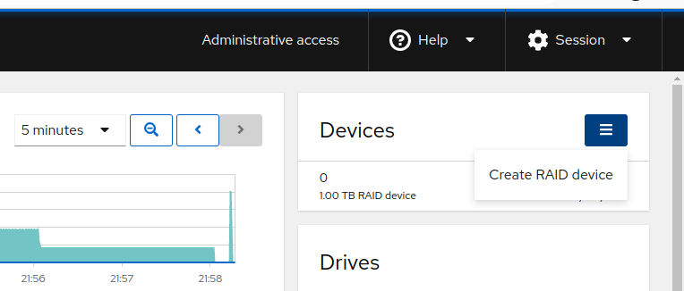
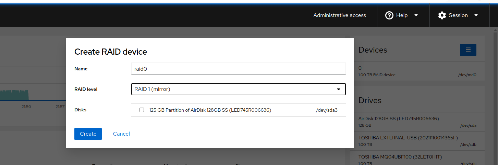

:toc:
:icons: font
:source-highlighter: prettify
:project_id: homelab
:tabsize: 2

== 1. Hardware specs and BIOS setup

=== Hardware specs

I decided to buy a budget minipc to build my homelab. Most significant hardware specs are the following:

[source]
----
mac@minipc:~$ lscpu
Architecture:            x86_64
  CPU op-mode(s):        32-bit, 64-bit
  Address sizes:         39 bits physical, 48 bits virtual
  Byte Order:            Little Endian
CPU(s):                  4
  On-line CPU(s) list:   0-3
Vendor ID:               GenuineIntel
  Model name:            Intel(R) Celeron(R) CPU J3455 @ 1.50GHz
    CPU family:          6
    Model:               92
    Thread(s) per core:  1
    Core(s) per socket:  4
    Socket(s):           1
----

[source]
----
mac@minipc:~$ more /proc/meminfo
MemTotal:        7982160 kB
----

[source]
----
mac@minipc:~$ sudo smartctl -a /dev/sda
...
Device Model:     AirDisk 128GB SSD
Rotation Rate:    Solid State Device
SATA Version is:  SATA 3.2, 6.0 Gb/s (current: 6.0 Gb/s)
...
----

For my use case, these hardware specs are perfectly ok regarding cpu and memory. However, only one 128 GBs disk drive is clearly not enough to meet my storage requirements in both capacity and fault-tolerance.

*I describe how to create a software-based homemade NAS storage* based on a pair of 1 TB external USB disks in section 3 (External storage).

=== BIOS setup

BIOS setup for personal pcs are normally set to *boot only when a start button is pressed*. This minipc is a server running 24/7 so in the event of a power outage, I prefer the server to boot automatically when power is restored. This simple config avoids any manual task to restore service.

This kind of low level power management is configured at BIOS level, not in the operating systems. My BIOS is an old American Megatrend one and the setting to change is placed in the *Boot/State After G3* option and must be set to *"Power On"*.

image::src/bios/boot_on_power_outage.jpg[]

== 2. Linux installation

=== Linux version

Standard stuff here. Downloaded *Ubuntu 22.04 Server* ISO file and flashed in a USB stick. Booted minipc from the USB drive and conducted a common  installation.

Since the minipc final location is in a very uncomfortable place (in the top of a bookshelf), I installed the Ubuntu Server similarly to how desktop machines are installed, reusing my usual keyboard, screen and wifi connection via DHCP.

=== Disk partitioning

Ubuntu graphical installer makes very easy to use LVM. I decided to use the automatic partition table suggested by the installer because it was exactly what I was looking for: a GPT partition table and the / file system mounted under a LVM Volume Group.

[source]
----
mac@minipc:~$ lsblk
NAME                      MAJ:MIN RM   SIZE RO TYPE  MOUNTPOINTS
sda                         8:0    0 119,2G  0 disk
├─sda1                      8:1    0     1G  0 part  /boot/efi
├─sda2                      8:2    0     2G  0 part  /boot
└─sda3                      8:3    0 116,2G  0 part
  └─ubuntu--vg-ubuntu--lv 253:0    0 116,2G  0 lvm   /
----

Each partition of the disk has a very common and clear goal:
[source]
----
- /boot/efi is where OS-independent bootloader is stored (grub2 in my case)
- /boot is where linux boot-related binaries are stored (mainly kernels and ramdisks).
- / is the root of the file system. It is mounted using LVM.
----

Since / is mounted under a LVM volume group, it's easy to create more logical volumes if required. LVM provides a lot of flexibility to rearrange volumes.

The only modification I did was to change the level of disk space reserved to root in emergency situations. I finally reserved 1% to root and the size of the logical volume perfectly matched the free space of the disk.

[source]
----
tune2fs -m 1 /dev/mapper/ubuntu--vg-ubuntu--lv
----

=== Network interfaces

Since server network configuration is very different to a normal smartphones/desktops/laptops which normally act as clients, IPs can't be dynamically assigned via DHCP. Do you remember I used my normal wifi to install Ubuntu? Let's fix that.

In a server, the network interfaces has fixed IPs in order be found easily by the clients. Disabling DHCP is mandatory.

My minipc has 2 network interfaces (ethernet and wireless):

[source]
----
mac@minipc:~$ lspci
01:00.0 Ethernet controller: Intel Corporation Ethernet Controller I225-V (rev 01)
02:00.0 Network controller: Intel Corporation Wireless 3165 (rev 79)
----

My minipc is placed in the top of a bookshelf, close to the router. I wired minipc to the router via an ethernet cable. To lower the power consumption and to increase security of the minipc I disabled the wireless interface. The wifi interfaces was mainly used to install ubuntu but for 24/7 production server I prefer the stability an ethernet cable.

Ubuntu has plenty options to configure the network interfaces. I finally used netplan and created 2 yaml files:

[source]
----
mac@minipc:~$ ls -a /etc/netplan/
.  ..  ethernet.yaml  .wifi.yaml
----

The config file for the wifi is prefixed by ".", disabling the wireless interface. Both config files can be found https://github.com/macvaz/homelab/tree/main/src/networking[here.]

=== Installing addition ubuntu packages

Most of the applications running in the minipc are deployed as docker containers. However, these ubuntu packages are required to be installed using apt

[source]
----
- docker.io: Docker engine
- docker-compose: Multi-container docker applications
- mdadm: Software RAID management
- wireguard: VPN server
- cockpit: Web interface for linux system administration
- cockpit-file-sharing: Controlling SAMBA and NFS from cockpit
- cockpit-identities: Controlling users and passwords for SAMBA and NFS from cockpit
- rclone: Off-site backup
- borgbackup: Encrypted, deduplicated, onsite backup
- vorta: Frontend for borg backup
- minidlna: Export media content via DLNA to smart TV
- ssmpt: Link mail command line tool to ssmpt allowing security emails reach my personal account
- mutt: Command line email client to easily sending email programaticaly from shell scripts
----

=== Software distributed from hardware verdors

Some hardware is distribuited directly from vendor's website

[source]
----
- PowerMaster+: UPS monitor from https://www.powermonitor.software/#PowerMasterPlusSoftware (PowerWalker)
----

== 3. External storage

This minipc is intended to *host 1 on-site fault-tolerant backup for my family media (photos and videos)* so only one disk is not a valid option.

*NAS appliances are a common IT hardware* that provides both large storage capacity and fault-tolerance. Since you have to buy both the chassis and at least 2 disks, NAS appliances are expensive. If you don't mind to pay that cost, I recommend Synology NAS home appliances.

*There are also open-source NAS servers like FreeNAS|TrueNAS, OpenMediaVault or Amahi*. However, all of them are based on OS different from Ubuntu (mostly FreeBSD, Debian and Redhat's Linux versions). These servers are distributed as packages of their native OS and also as ISO images. *None of them has official support for Docker* and requires hardware virtualization solutions like Proxmox VE or KVM that I would like to avoid in my minipc.

Consequently, *I decided to build my NAS server from the scratch*. Linux has a lot of projects (mdadm, cockpit, nfs server, samba server, minidlna, etc) that jointly with well-known open-source applications (like syncthing, nextcloud, rclone, etc) allows to create a low-end NAS server easily. Just to be clear, a high-end NAS server requires dedicated hardware but this software-based solution is enough for our storage requirements.

Next I describe the final solution implemented.

=== Create a RAID 1 device

The cheapest solution for creating a redundant storage device for a minipc, is *to connect 2 external USB hard drives and combine them in a redundant multiple disk (md) under a RAID 1 structure*. Since /dev/sda is used only as system drive, this new RAID device (/dev/md0) is exclusively use to support the NAS.

The model and basic specs fo the 2 external USB drives are:

[source]
----
mac@minipc:~$ sudo smartctl -a /dev/sdb
...
Model Family:     Toshiba 2.5" HDD MQ04UBF... (USB 3.0)
Device Model:     TOSHIBA MQ04UBF100
...
----

After connecting the 2 devices, a new RAID 1 device can be easily created using *a software RAID controller called mdadm* (multiple device administration). In a linux box, as everyone can imagine, mdadm can be set up in a configuration file (https://github.com/macvaz/homelab/tree/main/src/raid1/mdadm.conf[/etc/mdadm/mdadm.conf])

I first created this conf file manually. It's a bit tricky since it requires to recreate the ramdisks in order to mount the disk at boot time. In case you miss this step, your next server reboot will fail. That happens so follow the instructions carefully.

Nowadays, *I would rather recommend to use a frontend (like cockpit) instead of using mdadm direct*. I discovered cockpit after mounting the RAID and I totally fell in love. It's a web-based administration front-end for Linux (similar to Webmin but more updated) that makes administering a Linux box easier (for people like me, software developers, finding all key information in the same web page is gold).

Creating and monitoring a new RAID 1 device with cockpit is quite simple and it doesn't forget to update ramdisks :)

After creating the /dev/md0 device, the block devices of the minipc are the following:

[source]
----
mac@minipc:~$ lsblk
NAME                      MAJ:MIN RM   SIZE RO TYPE  MOUNTPOINTS
sda                         8:0    0 119,2G  0 disk
├─sda1                      8:1    0     1G  0 part  /boot/efi
├─sda2                      8:2    0     2G  0 part  /boot
└─sda3                      8:3    0 116,2G  0 part
  └─ubuntu--vg-ubuntu--lv 253:0    0 116,2G  0 lvm   /
sdb                         8:16   0 931,5G  0 disk
└─sdb1                      8:17   0 931,5G  0 part
  └─md0                     9:0    0 931,4G  0 raid1 /mnt/nas
sdc                         8:32   0 931,5G  0 disk
└─sdc1                      8:33   0 931,5G  0 part
  └─md0                     9:0    0 931,4G  0 raid1 /mnt/nas
----

=== NAS network protocols (SMB and NFS)
cockpit
cockpit-file-sharing

=== Media player
minidlna

== 4. VPN and external access

=== Dynamic DNS
  NoIP
=== Blocking direct traffic to Router DNS
  adblocking (pihole)
  Mainly problematic with Android phones
=== Port forwading for VPN and ¿nextcloud?

=== VPN
  wireguard
  laptop scripts
  mobile phones

== 5. Docker

=== Containers

Running containers

[source]
----
  - Pihole
  - Syncthing
  - Portainer
  - Heimdall
  - Uptime-kuma
  - Photoview
  - Mariadb
  - Watchtower
----

In analysis:

[source]
----
  - Traefik
  - Next-cloud
  - Homeassistant
  - Plex / kodi / jellybin / emby
  - freeipa
  - teleport
----

=== Docker-compose

https://github.com/macvaz/homelab/tree/main/src/docker[YAML file]

== 6. Backups

=== Onsite backups
  syncthing + some bash writing on RAID

=== Offsite backups

https://github.com/macvaz/homelab/tree/main/src/backup/backup_last_month_photos.sh[Monthly backup script using rclone]

