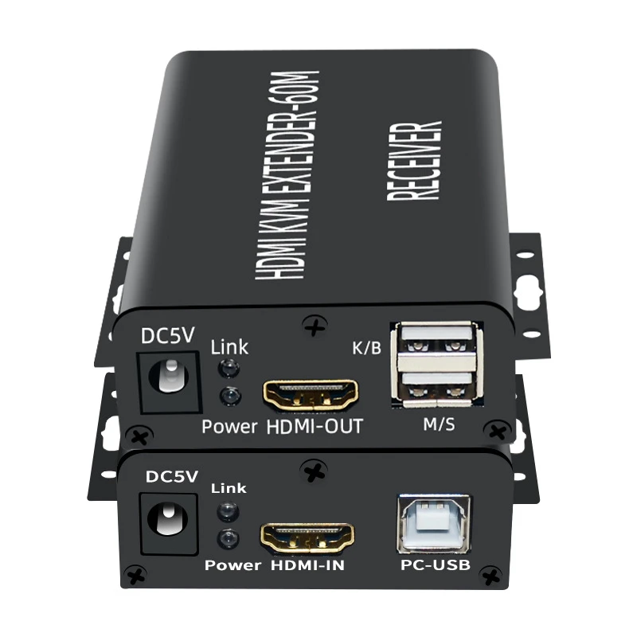

:toc:
:icons: font
:source-highlighter: prettify
:project_id: homelab
:tabsize: 2

== 1. Hardware architecture

Due to the lack of free physical space at home, using software-defined IT infrastructure like *hyper-converged infrastructure (HCI)* was ideal. HCI allows virtualizing most traditional hardware equipment (mainly computing and storage) on a general-purpose unified hardware platform, without the need of specialized appliances for storage like NAS servers.

Both computing and storage infrastructure can be virtualized by software using hypervisors. Since *https://www.proxmox.com/en/proxmox-ve[Proxmox Virtual Environment (VE)] is the most common out-of-the-shelf open-source Type 1 hypervisor* available, it was selected as the base technology of the HCI server.

https://www.proxmox.com/en/proxmox-ve[Proxmox VE] offers a **complete HCI (Hyper-converged Infrastructure) solution ready for professional datacenter management**. Proxmox provides a lot of out-of-the-shelf solutions and best practices making most of the hardware and infrastructure chores very comfortable (like automatic backups, VM migrations, etc).

The complete hardware architecture of the homelab is the following:

image::img/physical_architecture.png[]

=== HCI node specs

Hyper-converged infrastructure (HCI) is a software-defined IT infrastructure configuration where storage and computing is virtualized on a unified hardware platform. Consequently no specialized hardware appliances are required for computation and storage.

==== Host OS (proxmox nodes)

Currently, there is only one hyper-converged node in the deployment: *"proxmox1"*. Its hardware specs are the following:

|===
|Host OS name | Service IP| Operating System| CPUs | Cores| RAM | SSD

|proxmox1
|192.168.1.6
|Proxmox VE 7.36 (based on Debian Linux)
|1 Intel Celeron (J5040)
|4
|16 GBs
|-1x 0.5TB (OS disk) +
 -2x 1TB (DATA disks)
|===

*Low power consumption was a requirement for hardware selection*. Since processing performance for a domestic server is normally high, low-end processor families like Intel Celeron are enough.

CPU model and motherboard were specifically selected trying to maximize a relative metric (performance / power) rather than an absolute one (like clock speed or MIPS). *With a TDP (thermal design power) of 10 watts*, both CPU model (Intel Celeron J5040) and mother-board (Asrock J5040 ITX) were outstanding options.

*All disks are SSD (Solid State Disks)*, which not only are very performant with very low latency times but also power efficient (less than 1 watt of power consumption per disk). The smallest SSD disk (OS disk) is for installing Proxmox VE hypervisor. The other 2 SDD disks (DATA disks) are set up in a RAID 1 deployment to provide fault-tolerant long-term storage (check https://github.com/macvaz/homelab#data-disks-layout[Data disks layout]).

=== Emergency power supply

One of the most important goals of the homelab is to remove our dependency with external cloud storage providers (like Google Drive), creating a fault-tolerant long-term private storage for domestic use. Consequently, *having a reliable power supply to our storage server is key* to guarantee a safe long-term data archival of my family media and sensitive documents.

*PowerWalker VI 1000 STL is a monitorized UPS (uninterrupted power supply)* that ensures power supply in event of power outage for nearly 1 hour to the router and the "proxmox1" node. If the external power supply has not been restored during an hour, the UPS starts a graceful shutdown of the node via the monitoring USB cable that connects the UPS and "proxmox1" node. Having a very power efficient hardware (around 20 watts) is key to have a emergency power supply of almost an hour.

In order to control the graceful shutdown, *a monitoring agent has to be installed in the "proxmox1" HCI node*. There were to possibilities for this installation: installing in the host OS ("proxmox1") or in a guest OS (VM). Proxmox VE is able to easily virtualize a USB device connected to the host OS, making it available for the guest OS. However, the connection of the UPS with the virtualized monitor agent was neither reliable (sometimes it didn't detect changes in UPS status) nor safe (it only shutted down the guest OS and not the complete node).

After installing the UPS monitor agent directly in the host OS ("proxmox1" node), all this unreliable behaviour stopped. *UPS monitor is the only software installed directly in the hypervisor (host OS)*, without creating any VM or LXC container. The monitoring agent is distributed directly from https://www.powermonitor.software/#PowerMasterPlusSoftware[vendor's website].

=== KVM extender

Since *"proxmox1" node* is placed at the top of a bookshelf, there is no easy access to the machine when SSH is not available. For core admin chores like UEFI changes, host OS installation or debugging boot failures, a KVM extender is really handy.

A *keyboard, video, and mouse (KVM) extender enables users to work locally on a computer from a distance*. Typically, it is a set of transmitter and receiver appliances. The *KVM transmitter unit is connected to "proxmox1" server* and captures the peripheral signals such as universal serial bus (USB) for keyboard and mouse, audio, and video. These signals are extended to a **remote user station where the monitors, keyboards, and mouse are powered by the KVM receiver unit**. KVM extenders overcome the distance limitation of HDMI®, DisplayPort™, and USB cables and transport these signals anywhere from 15 feet to several miles away from the system.

As the physical architecture diagram depicts, *there is no additional ethernet cable for connecting the 2 KVM extender units*. Since ethernet cable linking TV and router is reused when utilizing the KVM, TV losses ethernet connectivity during KVM usage.

image::img/kvm_extender_diagram.png[]

Some content of this section is taken from https://video.matrox.com/, that provides a great description of what a KVM extender is and how it works.

== 2. Host operating system (Proxmox hypervisor)

=== Installation

After downloading *Proxmox VE 7.3* ISO file, I used *ventoy* to flash it in a USB stick. I booted "proxmox1" node from the USB drive and conducted a common installation using the KVM extender. With good defaults, installing a Type 1 hypervisor is not harder than installing a general purpose OS.

Using a KVM extender during host OS installation has a main benefit: installing the server OS with all the hardware placed in its definitive location with final network connectivity.

=== OS disk layout

Proxmox VE graphical installer comes with very good disk management defaults. *Proxmox VE software is installed only in the OS disk (/dev/sdb), letting the other disks for data storage*. The final layout of the OS disk (/dev/sdb) looks very professional and at the same time, simple to understand:

|===
|Partition |LVM LV|Type| Goal

|sdb1
|-
|ext2?
|Grub2 OS-independent bootloader partition

|sdb2
|-
|vfat
|EFI System Partition (ESP), which makes it possible to boot on EFI systems. Linux kernel images are stored in this partition and mounted in /boot/efi

|sdb3
|*swap*
|swap
|lvm LV where Proxmox VE places the swap space

|sdb3
|*root*
|ext4
|lvm LV mounted as the root file system (/) of Proxmox

|sdb3
|*data*
|LVM-thin
|lvm thin provisioning volume used to store vDisks

|===

For clarity, in the above table only LVM logical volumes (LVs) are shown. There is also one physical volume (PV) called "pve" and a volume group (VG) called "pve".

=== Shared storage (Data disks layout)

The objective of data disks is to provide a fault-tolerant long-term storage solution for the homelab. Several storage solutions were considered when designing the storage system.

Proxmox supports https://pve.proxmox.com/wiki/Hyper-converged_Infrastructure[2 different HCI storage technologies]:

|===
|Technology |Description | Comments

|Ceph
|A both self-healing and self-managing shared, reliable and highly scalable storage system
|Cluster technology. Thought for having several nodes. Extra administration complexity. Not an appealing option.

|ZFS
|A combined file system and logical volume manager with extensive protection against data corruption, various RAID modes, fast and cheap snapshots
|Memory intensive. Recommended ECC memory. Not really an option

|===

Eventually, both HCI storage technologies were discarded and started to explore approaches similar to *traditional NAS appliances*. NAS servers are a very common IT solution that provides both large storage capacity and fault-tolerance. However, the lack of free space at home, makes having a dedicated hardware NAS appliance not a valid option.

The final approach was to *create a VM "nas", in "proxmox1" node, based on the open-source NAS server https://www.openmediavault.org/[OpenMediaVault]*. Proxmox VE allows to create a VM with direct access to both data disks using https://pve.proxmox.com/wiki/Passthrough_Physical_Disk_to_Virtual_Machine_(VM)[disk passthrough]. *OpenMediaVault VM "nas" detects both data disks as attached SATA disks*, making very easy to create a RAID 1 device over them.

*All storage-related tasks are centralized in the OpenMediaVault*: managing disks, creating file systems, administering RAID devices, creating SMB shares, creating users, creating and enforcing access policies, controlling quotas, etc. The only data management task done by Proxmox VE is running SMART checks in data disks and sending alarms in the event of failure.

=== Network topology

Using Proxmox graphical interface makes networking setup quite easy. It detected my home physical network (192.168.1.0/24) out of the box and allowed to set up easily a fixed IP address for proxmox1 (192.168.1.6).

The final deployment consists in 2 ip networks:

|===
|Network address |Visibility|Virtualization technology|Connected devices

|192.168.1.0/24
|External
|Physical + virtual switch (vmbr0) in Proxmox VE
|Physical devices and VM vNICs

|10.10.10.0/24
|Internal to "docker" VM
|Virtual switch (docker0) in Docker
|Docker containers

|===

Proxmox creates by default ** https://pve.proxmox.com/wiki/Network_Configuration[a virtual bridge (vmbr0)]** in "proxmox1" node. *This bridge works as a switch, effectively extending my home physical network (192.168.1.0/24) to any VM created inside "proxmox1" node*. This bridged network setup is very convenient in a homelab environment as each VM gets an IP directly from the router address space, making guest OS (VMs)  indistinguishable from host nodes (hypervisors) from a networking point of view.

This bridged configuration assigns several IP addresses (host's IP and guests' IPs) to the same physical NIC ("proxmox1" eno1). This setup is normally not allowed in CSPs (Cloud Service Providers), where networking equipment block traffic coming from different VMs with the same MAC address.

Apart from virtual networking devices created by Proxmox VE, there also another networking virtualization technology: Docker. *Internal to "docker" VM, a software-defined  network (10.10.10.0/24) is created, only being used by docker containers to communicate each other*. Physical devices (like mikrotik router, TV and mobile clients) are totally unaware of this internal network, that is not addressable from them.

Proxmox VE allows to create additional virtual networks (based on bridged, routed or NATed configurations). No extra virtual networks were created or used. All VMs created in "proxmox1" node have only 1 vNIC.

The network diagram of the proxmox1 node (without docker containers) is the following:

image::img/network_diagram.png[]

== 3. Guest operating systems (Proxmox VMs)

After describing the hardware architecture in chapter 1 and the hypervisor setup in chapter 2, an in depth review of the logical architecture is described in chapter 3.

=== Virtual infrastructure

This chapter describes the software-defined infrastructure (VMs and virtual networks) created to run the homelab. There are 2 VMs with very different responsibilities:

|===
|VM name |Resource type |Goal

|docker
|Computation
|VM where all docker containers are executed. Uses SMB shared storage drives served by "nas" VM.

|nas
|Storage
|Centralizes all shared storage devices, technologies and services (RAID 1, SMB drives, access control). Based on open-source NAS server OpenMediaVault
|===

A more detailed description of the virtual resources of each VMs is listed here:

|===
|VM name | Type | Service IP| Guest OS| vCPUs (Cores)| RAM | Storage

|docker
|Proxmox VM
|192.168.1.2
|Ubuntu Server 22.04
|3
|3 GBs
|- 2 vDisks +
- external SMB drives

|nas
|Proxmox VM
|192.168.1.5
|OpenMediaVault 6.3 (based on Debian 11)
|2
|2 GBs
|- 1 vDisk (for OS) +
- 2 SDD physical disks (via disk passthrough)

|===

=== Logical architecture

In the next logical architecture diagram, the main software services running in the homelab are presented. This diagram includes services running in both bare-metal infrastructure (hypervisor) and virtual infrastructure ("nas" and "docker" VMs).

image::img/logical_architecture.png[]

=== "docker" VM

Most of the applications running in the minipc are deployed as docker containers. However, these ubuntu packages are required to be installed using apt

[source]
----
- qemu-guest-agent: Guest agent for better power managent from host
- docker.io: Docker engine
- docker-compose: Multi-container docker applications
- rclone: Off-site backup
- minidlna: Export media content via DLNA to smart TV
- ssmpt: Link mail command line tool to ssmpt allowing security emails reach my personal account
- mutt: Command line email client to easily sending email programaticaly from shell scripts
- ddclient: Register dynamic IP in cloudflare
----

==== Containers

Running containers

[source]
----
  - Pihole
  - Syncthing
  - Portainer
  - Heimdall
  - Uptime-kuma
  - Watchtower
  - Nextcloud
  - Nginx Proxy Manager
----

In order to run pihole DNS service on Ubuntu server, disable systemd-resolved local DNS server. A good practice is to point primary name server to a local DNS server (if existing) and a secondary name server to a well-known DNS server like Google (8.8.8.8).

In analysis:

[source]
----
  - Homeassistant
  - Plex / kodi / jellybin / emby
  - freeipa
  - teleport
----

==== Docker-compose

https://github.com/macvaz/homelab/blob/main/docker/docker-compose.yaml
[YAML file]

=== "nas" VM

Description of https://www.openmediavault.org/[OpenMediaVault] installation and setup

[source]
----
  - RAID 1
  - File systems
  - SMB shares
  - quotas
  - user permissions
----

