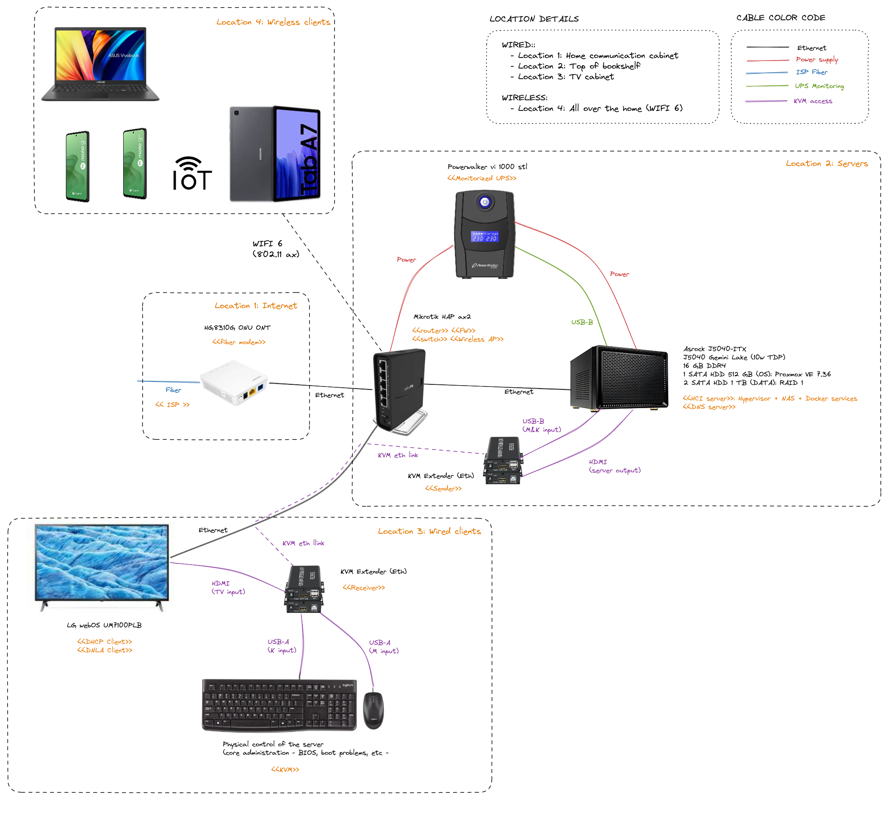

:toc:
:icons: font
:source-highlighter: prettify
:project_id: homelab
:tabsize: 2

== 1. Hardware architecture

Due to the lack of free physical space at home, a software-defined IT infrastructure approach like *hyper-converged infrastructure (HCI)* was found ideal. HCI allows virtualizing most traditional hardware equipment using software-defined computing, networking and storage.

Enterprise-level HCI deployments doesn't require specialized hardware appliances for storage - like NAS appliances - that are very common in traditional IT deployments. Both computing and storage infrastructure can be virtualized by software using hypervisors. Since *Proxmox Virtual Environment (VE) is the most common open-source Type 1 hypervisor* available, it was selected as the base technology of the HCI server.

=== Hyper-converged infrastructure (HCI) specs

==== Nodes

|===
|Node name | Service IP| Operating System| CPUs | Cores| RAM | SSD

|proxmox
|192.168.1.6
|Proxmox VE 7.36
|1 Intel Celeron (J5040)
|4
|16 GBs
|-1x 0.5TB (OS disk) +
 -2x 1TB (DATA disks)
|===

The smaller SSD disk (OS disk) is for installing Proxmox VE. The other 2 SDD disks (DATA disks) are set up in a RAID 1 deployment to provide fault-tolerant long-term storage.

=== KVM (Keyboard video mouse) specs

Since *proxmox node* is placed at the top of a bookshelf, there is no easy access when SSH is not available. For core admin chores like UEFI changes or boot failures, the KVM extender is really helpful.

Just connect a USB keyboard and mouse to the receiver KVM device. There is no additional ethernet cable for the KVM so the ethernet cable linking TV and router is reused to connect KVM receiver and sender. TV losses ethernet connectivity when using KVM extender.

=== Network equipment specs

Describe Mikrotik HAP ax2
VLANs
FW
DNS pointing to pihole

=== Uninterrupted power supply (UPS) specs

Describe PowerWalker VI 1000 STL
USB cable
Automatic shutdown

== 2. OS installation of proxmox node

Proxmox VE offers a **complete HCI (Hyper-converged Infrastructure) solution ready for professional datacenter management**. Proxmox provides a lot of out-of-the-shelf solutions and best practices making most of the hardware and infrastructure chores very comfortable.

After downloading *Proxmox VE 7.3* ISO file, I used *ventoy* to flash it in a USB stick. I booted proxmox node from the USB drive and conducted a common installation. With good defaults, installing a Type 1 hypervisor is not harder than installing a general purpose OS.

If there is a KVM available, the recommended way of installing Proxmox VE is through the KVM extender. The main benefit is to conduct the OS installation with the server placed in its definitive location and network connectivity.

=== OS Disk partitioning

Proxmox graphical installer comes with very good disk management defaults. Proxmox software is installed only in one disk (/dev/sdb), letting the other disks to create storage pools using the web interface after installation. The final layout of the OS disk (/dev/sdb) looks very professional and at the same time, simple to understand:

[source]
----
>> root@proxmox:~$ lsblk
sdb
├─sdb1
├─sdb2                       vfat        FAT32                    /boot/efi
└─sdb3                       LVM2_member LVM2
  ├─pve-swap                 swap
  ├─pve-root                 ext4        1.0      PROXMOX_ROOT    /
  ├─pve-data_tmeta
  │ └─pve-data-tpool
  │   └─pve-data
  └─pve-data_tdata
    └─pve-data-tpool
      └─pve-data
----

Each partition or volume group has a common and clear goal:
[source]
----
- /boot/efi is where OS-independent bootloader is stored (grub2 in my case)
- pve-swap is the lvm volume group where Proxmox VE placed the swap space
- pve-root voluge group is where the root file system of Proxmox is placed.
- pve-data_tmeta (metadata) is a LVM-based thin provisioning volume used to store virtual hard disks
- pve-data_tdata (data) is a LVM-based thin provisioning volume used to store virtual hard disks
----

=== Networking

Using Proxmox graphical interface makes network setup quite easy. It detected my router physical network out of the box and allowed to set up easily a fixed IP address for Proxmox. This IP is visible in all my LAN and is where Proxmox VE GUI can be found.

Proxmox creates a default ** virtual bridge vmbr0** linked with the default ** ethernet physical NIC eno1** in such a manner each NIC of a VM is created directly in the same network range of the physical network of my router. Quite simple setup and very convenient.

[source]
----
>> root@proxmox:~$ ip a
...
2: eno1: <BROADCAST,MULTICAST,UP,LOWER_UP> mtu 1500 qdisc mq master vmbr0 state UP group default qlen 1000
    link/ether 68:1d:ef:28:1d:0e brd ff:ff:ff:ff:ff:ff
    altname enp1s0
...
4: vmbr0: <BROADCAST,MULTICAST,UP,LOWER_UP> mtu 1500 qdisc noqueue state UP group default qlen 1000
    link/ether 68:1d:ef:28:1d:0e brd ff:ff:ff:ff:ff:ff
    inet 192.168.1.6/24 scope global vmbr0
       valid_lft forever preferred_lft forever
    inet6 fe80::6a1d:efff:fe28:1d0e/64 scope link
       valid_lft forever preferred_lft forever
...
----

=== Redundant storage

*NAS appliances are a common IT solution* that provides both large storage capacity and fault-tolerance. Since you have to buy both the chassis and at least 2 disks, NAS appliances are expensive. If you don't mind to pay that cost, I recommend Synology NAS home appliances.

Proxmox fault-tolerant storage pools are based on ZFS but *my CPU and memory are not ECC-compatible*. Consequently I decided to create a software-based NAS solution using an *open-source NAS server like OpenMediaVault (OMV)*. Proxmox VE allows to create a VM to run a virtualized NAS server, exposing both DATA disks to the VM using Disk passthrough. Under this setup, Proxmox doesn't control data disks, giving direct access to the disks to OMV.

=== Additional configuration of proxmox

Since most of the software is going to be installed inside a VM, at the hypervisor level, very few extra packages are required.

The most important thing missing is to set up email relay for automatic alarms. To configure it, just follow Techno Tim's video: https://www.youtube.com/watch?v=85ME8i4Ry6A

An extract of the configuration steps is the following:

[source]
----
>> apt install -y libsasl2-modules mailutils

# Setup credentials in the sasl_passwd file following this format
>> more /etc/postfix/sasl_passwd
smtp.gmail.com email:passwd

# Create a hashed version of the file
>> postmap hash:/etc/postfix/sasl_passwd
>> chmod 600 /etc/postfix/sasl_passwd

# Paste next configuration in /etc/postfix/main.cf file:
realayhost = smtp.gmail.com:587
smtp_use_tls = yes
smtp_sasl_auth_enable = yes
smtp_sasl_security_options =
smtp_sasl_password_maps = hash:/etc/postfix/sasl_passwd
smtp_tls_CAfile = /etc/ssl/certs/Entrust_Root_Certification_Authority.pem

# Restart postfix
>> postfix reload
----

=== Software distributed from hardware verdors

Some hardware is distributed directly from vendor's website. The UPS monitor should be installed at hypervisor level, not VM level. In the event of a power outage, the complete server, including both hypervisor and all vms, should be shut down when the battery is running out.

Initially I deployed and configured the UPS monitor in a VM but this deployment wes neither reliable (sometimes it didn't detect changed in UPS) nor safe (it only shut down the vm and not the hypervisor)

[source]
----
- PowerMaster+: UPS monitor from https://www.powermonitor.software/#PowerMasterPlusSoftware (PowerWalker)
----

== 4. Virtual machines (VMs)

|===
|VM name | Service IP| Operating System| vCPUs (Cores)| RAM | Disks

|docker
|192.168.1.2
|Ubuntu Server 22.04
|3
|3 GBs
|

|nas
|192.168.1.5
|Debian 11
|2
|2 GBs
|

|===

In case of creating VMs from a general purpose Ubuntu server, disable systemd-resolved local DNS server. A good practice is to point primary name server to a local DNS server (if existing) and a secondary name server to a well-known DNS server like Google.

=== Cloud init & cloud images

In general creating VMs from an general-purpose ISO image is not the best approach. Cloud images are a much better alternative. 

https://cloud-images.ubuntu.com/minimal/releases/jammy/release-20230209/
https://pve.proxmox.com/wiki/Cloud-Init_Support

[source]
----
# download the "minimal" cloud image
wget https://cloud-images.ubuntu.com/minimal/releases/jammy/release-20230209/ubuntu-22.04-minimal-cloudimg-amd64.img

# create a new VM with VirtIO SCSI controller
qm create 9000 --memory 2048 --net0 virtio,bridge=vmbr0 --scsihw virtio-scsi-pci

# import the downloaded disk to the local-lvm storage, attaching it as a SCSI drive
qm set 9000 --scsi0 local-lvm:0,import-from=/root/ubuntu-22.04-minimal-cloudimg-amd64.img

# configure a CD-ROM drive, which will be used to pass the Cloud-Init data to the VM
qm set 9000 --ide2 local-lvm:cloudinit

# boot directly from the Cloud-Init image
qm set 9000 --boot order=scsi0

# configure a serial console and use it as a display
qm set 9000 --serial0 socket --vga serial0

# convert to template
qm template 9000
----

=== Ubuntu packages

Most of the applications running in the minipc are deployed as docker containers. However, these ubuntu packages are required to be installed using apt

[source]
----
- qemu-guest-agent: Guest agent for better power managent from host
- docker.io: Docker engine
- docker-compose: Multi-container docker applications
- rclone: Off-site backup
- minidlna: Export media content via DLNA to smart TV
- ssmpt: Link mail command line tool to ssmpt allowing security emails reach my personal account
- mutt: Command line email client to easily sending email programaticaly from shell scripts
----

=== Containers

Running containers

[source]
----
  - Pihole
  - Syncthing
  - Portainer
  - Heimdall
  - Uptime-kuma
  - Photoview
  - Mariadb
  - Watchtower
----

In analysis:

[source]
----
  - Traefik
  - Next-cloud
  - Homeassistant
  - Plex / kodi / jellybin / emby
  - freeipa
  - teleport
----

=== Docker-compose

https://github.com/macvaz/homelab/tree/main/src/docker[YAML file]

== 5. VPN and external access

=== Dynamic DNS
  NoIP
=== Blocking direct traffic to Router DNS
  adblocking (pihole)
  Mainly problematic with Android phones
=== Port forwading for VPN and ¿nextcloud?

=== VPN
  wireguard
  laptop scripts
  mobile phones

== 6. Backups

=== Onsite backups
  syncthing + some bash writing on RAID

=== Offsite backups

https://github.com/macvaz/homelab/tree/main/src/backup/backup_last_month_photos.sh[Monthly backup script using rclone]

