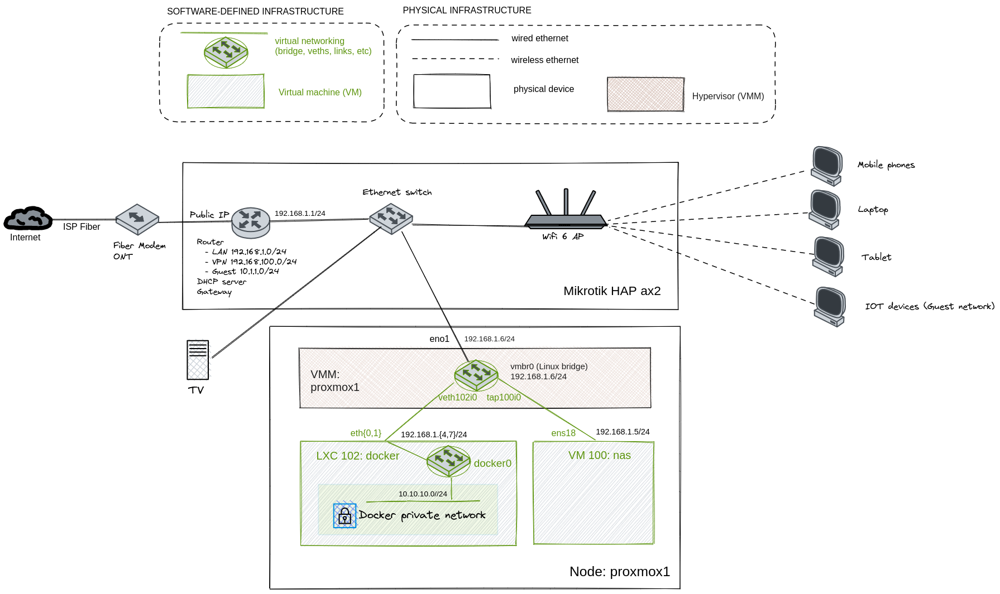

:toc:
:icons: font
:source-highlighter: prettify
:project_id: homelab
:tabsize: 2

== 1. Hardware architecture

In a production-grade IT hardware architecture, several specialized appliances are normally deployed. However, homelabs are placed in residential environments where space restrictions can be the limiting factor for hardware selection. 

Selecting devices with small form factors is a must to reduce physical space requirements. In addition, power efficiency is also mandatory for this kind of devices as they operate 24x7 but normally running low computational loads. *Virtualization technologies may help in both aspects: space savings and power efficiency*.

The selected hardware equipment for the homelab is:

|===
|Device name | Device type |Model |Description| IP address

|router1
|Networking device
|https://mikrotik.com/product/hap_ax2[Mikrotik Hap ax²]
|Flexible SOHO router running RouterOS
|192.168.1.1

|proxmox1
|Virtualization node
|Components bought from different vendors
|Flexible power-efficient server for running Proxmox VE hypervisor
|192.168.1.6

|ups
|UPS unit
|https://powerwalker.com/product/10121074/[PowerWalker VI 1000 STL]
|Uninterrupted power supply unit
|-

|kvm
|KVM extender
|Cheap Aliexpress model
|Keybord video mouse (KVM) extender for managing locally a remote server
|-

|===

In the following sections, each device is described briefly. In next chapters, the solution gets described into deeper details.

=== Network topology

My home network is a traditional https://community.fs.com/blog/what-is-a-small-office-home-office-soho-network-and-how-to-set-up-one.html[SOHO network] with a *unique network device (Mikrotik AX2) acting like a router, DHCP server, internet gateway, ethernet switch, WIFI access point and a VPN server*. There is an external modem (ONT) from the ISP provider. Most of the devices are connected through wireless interfaces. Only 2 devices (TV and proxmox1) are connecting using wired ethernet.

.All physical networking is configured in the Mikrotik Hap AX2 device using https://wiki.mikrotik.com/wiki/Manual:Winbox[winbox client], including:
* setup of 3 different local IP networks
* PPPoE negociation with the ISP to get a public IP for the WAN interface
* VPN server setup based on Wireguard
* update of public IP in cloudflare DNS service using this link:/router/cloudflare.rsc[custom routerOS script]
 
The most meaningful details of the physical networks are the following:

|===
|Network address |Network name | Description |Connected devices

|192.168.1.0/24
|LAN
|Main network of the router
|Virtualization server, TV and trusted wireless devices connects here

|192.168.100.0/24
|VPN
|Network for connecting securely to LAN network from the internet
|Trusted devices properly configured in wireguard VPN server

|10.1.1.0/24
|Guest
|Provides internet access only, blocking all internal traffic to LAN network
|Untrusted wireless devices connects here

|===

*Virtual networking, which is created within the virtualization server*, is described in <<virtual_servers, virtual servers chapter>>. The next diagram only shows physical networking: 

image::img/networking_devices.png[]

=== Virtualization node

In a residential environment, optimizing the number of specilized hardware appliances is key for reducing required space. *Using virtualization servers (a.k.a hypervisors) make possible running virtual IT infrastructure in an single general-purpose hardware appliance* like proxmox1.

https://www.proxmox.com/en/proxmox-ve[Proxmox VE] offers a complete virtualization solution ready for professional datacenter management. Proxmox VE is based on KVM kernel virtualization technology and provides a lot of out-of-the-shelf solutions and best practices.

*In the homelab, there is only 1 virtualization node (proxmox1), that hosts all virtual infrastructure*. Its hardware specs are the following:

|===
|Host OS name | IP address| Operating System| CPUs | Cores| RAM | OS Disk | Data disks

|proxmox1
|192.168.1.6
|Proxmox VE 7.36 (based on Debian Linux)
|1 Intel Celeron (J5040)
|4
|16 GBs
|0.5TB SSD
|2x 1TB SSD
|===

Proxmox *hypervisor allows the creation of virtual servers (VMs and LXC containers) by sharing the underlying hardware* of the virtualization node. Hypervisor manages physical hardware as resource pools that are asigned to virtual servers at creation time. Each virtual server thinks its hardware resources are dedicated.

Hardware selection was basically driven by power efficency. *With a combined TDP (thermal design power) of 15 watts*, both CPU model (Intel Celeron J5040) and mother-board (Asrock J5040 ITX) were outstanding options.

Since *all disks are SSD (Solid State Disks)*, IO is not only very performant but also power efficient (less than 1 watt of power consumption per disk). 

=== Emergency power supply

*Having a reliable power supply to our storage server is key* to guarantee a safe long-term data archival of my family media and sensitive documents.

*PowerWalker VI 1000 STL is a monitorized UPS (uninterrupted power supply)* that ensures power supply in event of power outage for nearly 1 hour to the router and the "proxmox1" node. If the battery is running out of energy, the UPS starts a gracefull shutdown via the USB-B cable that connects the UPS with the "proxmox1" node.

=== KVM extender

There is no easy physical access to the virtulization server when SSH is not available. For core admin chores like UEFI changes, host OS installation or debugging boot failures, a KVM extender is really handy. A *keyboard, video, and mouse (KVM) extender* enables users to work locally on a computer from a distance. 

image::img/kvm_extender_diagram.png[]

Some content of this section is taken from https://video.matrox.com/, that provides a great description of what a KVM extender is and how it works.

=== Complete hardware architecture

Once described into some detail all devices, a complete hardware architecture is shown:

image::img/physical_architecture.png[]

== 2. Virtualization node (Proxmox hypervisor)

Installing *Proxmox Virtual Environment (PVE) 7.3* is not harder than installing any Linux-based OS. *ventoy* was used to flash Proxmox PVE ISO file in a USB stick. proxmox1 was then booted from the USB drive and conducted a common installation using the KVM extender.

=== OS disk

Proxmox VE installer provides by default a simple but professional OS disk layout. *Proxmox VE software is installed only in the OS disk (/dev/sdb), reserving the other 2 disks for data storage*.

|===
|OS disk partition | LVM LV| Type| Goal

|sdb1
|-
|ext2?
|Grub2 OS-independent bootloader partition

|sdb2
|-
|vfat
|EFI System Partition (ESP), which makes it possible to boot on EFI systems. Linux kernel images are stored in this partition and mounted in /boot/efi

|sdb3
|*swap*
|swap
|lvm LV where Proxmox VE places the swap space

|sdb3
|*root*
|ext4
|lvm LV mounted as the root file system (/) of Proxmox

|sdb3
|*data*
|LVM-thin
|lvm thin provisioning volume used to store vDisks

|===

Above table only shows LVM LVs. There is also one physical volume (PV) called "pve" and a volume group (VG) called "pve".

=== Data disks

*A fault-tolerant long-term storage solution needs to be selected* for the two 1 TB SSD data disks (/dev/sda and /dev/sdc). Several storage solutions were considered when designing the storage system.

The first approach was checking fault-tolerant storage backends provided natively by Proxmox VE. There are https://pve.proxmox.com/wiki/Hyper-converged_Infrastructure[2 different storage technologies]:

|===
|Technology |Description | Comments

|Ceph
|A both self-healing and self-managing shared, reliable and highly scalable storage system
|Cluster technology designed for having several nodes. Extra administration complexity. Not a simple solution for only 1 node.

|ZFS
|A combined file system and logical volume manager with extensive protection against data corruption, various RAID modes, fast and cheap snapshots
|Memory intensive. The lack of recommended ECC memory was a no-go.

|===

Since both HCI native storage technologies supported by Proxmox where discarded, *the storage solution was built from the scratch* in a virtual server. Data disks are not managed by the Proxmox hypervisor which delegates that task to a virtual machine acting as storage server.

A virtual machine named "nas" was created with *both data disks directly attached to it by enabling disk-passthrough* at hypervisor level. Using this configuration, data disks (/dev/sda and /dev/sdc) are not used directly neither by the hypervisor nor other virtual servers. 

This virtual machine is based on the open-source NAS server https://www.openmediavault.org/[OpenMediaVault] (OMV) allowing a central management of the storage services. To get a detailed description of the long-term fault-tolerant storage design, check section <<nas_server, NAS server>>.

=== Network topology

Proxmox installer detected LAN physical network (192.168.1.0/24) out of the box, allowing to set up easily a fixed IP address for proxmox1 (192.168.1.6).

Virtualization node has only 1 NIC directly attached to my router. However, Proxmox allow to setup a https://pve.proxmox.com/wiki/Network_Configuration[bridged network configuration], extending LAN network address space to the virtual servers started inside the hypervisor. 

Proxmox creates a *Linux bridge interface (vmbr0)* to which all virtual servers are connected. This bridge is also connected to the physical NIC, reusing DHCP server and internet gateway from my Mikrotik router. Consequently, *virtual servers belong to the same IP network (LAN) than the rest of my home devices*. 

== 3. Virtual servers [[virtual_servers]]

*Proxmox allows creating 2 types of virtual servers: KVM VMs and LXC containers*. This chapter describes the software-defined infrastructure -virtual servers and networks- that were created. 

For running the homelab, 2 virtual servers were deployed, acting as application server and storage server:

|===
|Name |Server type |IP addresses |Goal

|nas
|Storage server
|192.168.1.5
|Virtual machine that centralizes all shared storage devices, technologies and services (RAID 1, SMB drives, storage management). Based on open-source NAS server OpenMediaVault (OMV)

|docker
|Application server
|192.168.1.4 192.168.1.7
|Linux Container (LXC) where all docker containers are executed. Uses SMB shared storage drives served by storage server.

|===

After describing the virtual servers in isolation, a *network diagram* can help to understand how they are connected. In order to differenciate physical from virtual networking, the former uses black lines and the latter uses green lines. 

The complete network diagram, including physical and virtual networking, can be found here:

=== NAS server [[nas_server]]

.This storage server is used to deploy the open-source NAS server OpenMediaVault (OMV). *OMV makes quite simple to create a storage server over commodity hardware* like proxmox1. OMV takes care of all storage-realated tasks like:
* managing physical disks
* creation and monitoring of fault tolerant storage devices (like RAID devices)
* creation of file systems and SMB shares
* policy definition and enforcing: users, permissions and quotas

The hardware specs are the following:

|===
|Name | Type | OS| vCPUs | RAM | Storage

|nas
|Virtual Machine
|OpenMediaVault 6.3 + 
(based on Debian 11)
|2
|3 GB
|- 1 vDisk (for OS) +
- 2 SSD physical disks (via disk passthrough)

|===

Proxmox VE allows to create virtual machines with direct access to physical disks using https://pve.proxmox.com/wiki/Passthrough_Physical_Disk_to_Virtual_Machine_(VM)[disk passthrough]. *OMV detects both data disks as attached SATA disks*.

Using OMV administration web tool, *creating a fault tolerant 1 TB RAID 1 device* with 2 SATA disks is quite simple. OMV manages *mdadm (Linux software RAID)* under the hood, offering a really smooth experience. As I wanted to create a file-based storage server (no block-based storaged required), an ext4 file system was created over the RAID device using OMV web GUI.

Now was time to choose which file-based network protocol to use in order to give access to the clients. OMV mainly offers NFS and SMB. *SMB protocol was finally choosen due to its security* features. 

Using OMV administration tool again, *3 storage drives* were created for external access. Each drive was secured with a user and password. The main features of each SMB drive are listed below:  

|===
|Drive name | Protocol | Description | Authorized users

|backups
|SMB
|Long-term storage of virtual servers backup files. When Proxmox backs up *nas* VM, NFS storage is frozen so this VM has a special 2-steps backup process.
|proxmox

|documents
|SMB
|Long-term storage for important documents. This drive is used by https://nextcloud.com/[NextCloud] application from docker server.
|docker

|media
|SMB
|Long-term storage for family media (photos and videos). This drive is used by https://www.photoprism.app/[PhotoPrism] application from docker server.
|docker

|===

=== Docker server [[docker_server]]

Docker is the facto standard for building, shipping and running containerized applications not only in the enterprise but also in homelabs. Not a surprise than almost all the user-facing applications running in the homelab are deployed as docker containers. 

Before describing containers running in the docker server, let's describe the underlying server specs:  

|===
|Name | Server Type | Guest OS| vCPUs | RAM | Storage

|docker
|LXC Container
|Proxmox LXC + 
debian 11 template
|3
|4 GB
|- 1 vDisks (docker images storage) +
- external SMB drives

|===

*docker* virtual server, contrary to the NAS server, was *built based on a Linux Container (LXC)* instead of a virtual machine. Proxmox allows to work with both virtualization technologies seamlessly. 

*OMV is a product* distributed in an ISO file with its own operating system. *Linux containers share the kernel with the hypervisor*, OMV ISO file is just not designed to work like that. However, a system build from the scratch from a Proxmox LXC Debian 11 template worked perfectly. 

Since this LXC template does not distribute a docker environment by default, it was required to install it from debian repositories: 

[source]
----
- docker.io: Docker engine
- docker-compose: Multi-container docker applications
----

Aditionally, some extra system packages were installed for house-keeping tasks and automations:

[source]
----
- qemu-guest-agent: Guest agent for better power managent from hypervisor
- rclone: Off-site backup
- minidlna: Export media content via DLNA to smart TV
- ssmtp: mail command line tool redirected to my gmail account
----

==== Containers

With a running docker environment, it's time to describe the containers deployed in the homelab.

[source]
----
  - Pihole
  - Portainer
  - Portfolio
  - Heimdall
  - Checkmk
  - Nextcloud
  - Nginx Proxy Manager
  - Transmission
  - Photoprism
  - mariadb
  - postgresql
----

In order to run pihole DNS service on Ubuntu server, disable systemd-resolved local DNS server. 

== 4. Logical architecture

In this section, the *main services and batch jobs* deployed on the homelab are presented. This diagram includes software running in both bare-metal infrastructure (hypervisor) and virtual infrastructure ("nas" and "docker" virtual servers).

In addition, the logical architecture diagram also presents the main external services used by the system. Excluding domain registration, all other services are fee of use. The main external services used are:

[source]
----
- NameCheap: Domain register (thehomelab.site)
- CloudFlare: DNS management
- Let's Encrypt: SSL certificates issuance
- Mega.io: off-site backup
----

image::img/logical_architecture.png[]

===== PiHole

===== Nextcloud

With Nextcloud Files, users have easy access and can share and collaborate on their files, photos and documents wherever they are. All that without any data leaks to third parties and having full control over their data.

Nextcloud operation documentation can be found xref:nextcloud.adoc[here].

===== Nginx Proxy Manager

===== Containers to analyze

In analysis:

[source]
----
  - Plex / kodi / jellybin / emby
  - freeipa / Authelia / Keycloack / goauthentik.io/
----

==== Docker-compose

https://github.com/macvaz/homelab/blob/main/docker/docker-compose.yaml
[YAML file]

