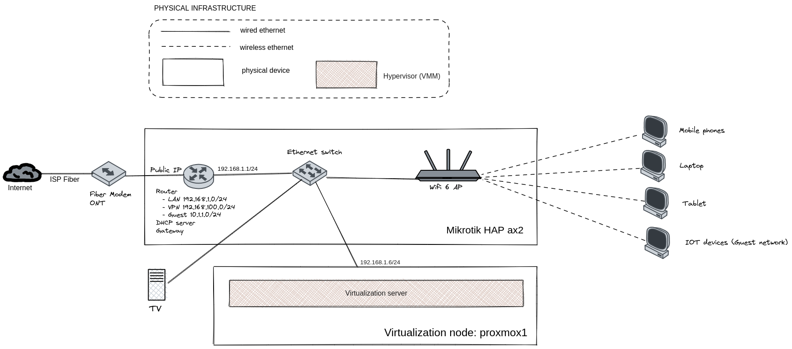

:toc:
:icons: font
:source-highlighter: prettify
:project_id: homelab
:tabsize: 2

== 1. Hardware architecture

In a production-grade hardware architecture, several specialized appliances are normally deployed. However, a homelab is in a residential environment and space requirements can be very demanding compared with a professional datacenters. 

Selecting devices with small form factors is a must. In addition, power efficiency is also mandatory for this kind of devices as they operate 24x7 but normally running low computational loads. Relying on virtualization technologies may help in both aspects.

The selected hardware equipment for the homelab is:

|===
|Device name | Device type |Model |Description| IP address

|router1
|Networking device
|Mikrotik AX2
|Flexible SOHO router running RouterOS
|192.168.1.1

|proxmox1
|Virtualization node
|Assembled computer (not a unique vendor)
|Flexible power-efficient server for running Proxmox VE hypervisor
|192.168.1.6

|ups
|UPS unit
|PowerWalker VI 1000 STL
|Uninterrupted power supply unit
|-

|kvm
|KVM extender
|-
|Keybord video mouse (KVM) extender for managing locally a remote server
|-

|===

In the following sections, each device is described briefly. In next chapters, the solution gets described into deeper details.

=== Network topology

My home network is a traditional https://en.wikipedia.org/wiki/Small_office/home_office[SOHO] network. 

In addition, there is a virtual server that runs docker, having its own virtual isolated network for connecting the Docker containers. The next table presents both network addressing details: 

|===
|Network address |Network type |Virtualization technology |Connected devices

|192.168.1.0/24
|Physical
|Physical network + virtual bridge in proxmox1 node
|Physical devices and VM vNICs

|10.10.10.0/24
|Virtual
|Virtual bridge (docker0) in Docker
|Docker containers

|===

=== Virtualization node

In a residential environment, optimizing the number of specilized hardware appliances is key for reducing required space. Using virtualization servers (a.k.a hypervisors) make possible running virtual IT infrastructure in an single general-purpose hardware appliance.

https://www.proxmox.com/en/proxmox-ve[Proxmox VE] offers a **complete virtualization solution ready for professional datacenter management**. Proxmox VE is based on KVM kernel virtualization technology and provides a lot of out-of-the-shelf solutions and best practices.

**Only 1 virtualization node (proxmox1) hosts virtual infrastructure** in the homelab. Its hardware specs are the following:

|===
|Host OS name | IP address| Operating System| CPUs | Cores| RAM | OS Disk | Data disks

|proxmox1
|192.168.1.6
|Proxmox VE 7.36 (based on Debian Linux)
|1 Intel Celeron (J5040)
|4
|16 GBs
|0.5TB SSD
|2x 1TB SSD
|===

Low power consumption was a requirement for hardware selection. *With a TDP (thermal design power) of 15 watts*, both CPU model (Intel Celeron J5040) and mother-board (Asrock J5040 ITX) were outstanding options.

Since *all disks are SSD (Solid State Disks)*, IO is not only very performant but also power efficient (less than 1 watt of power consumption per disk). 

=== Emergency power supply

*Having a reliable power supply to our storage server is key* to guarantee a safe long-term data archival of my family media and sensitive documents.

*PowerWalker VI 1000 STL is a monitorized UPS (uninterrupted power supply)* that ensures power supply in event of power outage for nearly 1 hour to the router and the "proxmox1" node. If the battery is running out of energy, the UPS starts a gracefull shutdown via the USB-C cable that connects the UPS with the "proxmox1" node.

=== KVM extender

There is no easy physical access to the virtulization server when SSH is not available. For core admin chores like UEFI changes, host OS installation or debugging boot failures, a KVM extender is really handy. A *keyboard, video, and mouse (KVM) extender* enables users to work locally on a computer from a distance. 

Some content of this section is taken from https://video.matrox.com/, that provides a great description of what a KVM extender is and how it works.

=== Complete hardware architecture

The complete hardware architecture of the homelab is the following:

image::img/physical_architecture.png[]

== 2. Virtualization node (Proxmox hypervisor)

Installing *Proxmox Virtual Environment (PVE) 7.3* is not harder than installing any Linux-based OS. I used *ventoy* to flash ISO file in a USB stick. proxmox1 was then booted from the USB drive and conducted a common installation using the KVM extender.

=== OS disk

Proxmox VE installer provides a simple but professional OS disk layout by default. *Proxmox VE software is installed only in the OS disk (/dev/sdb), letting the other 2 disks for data storage*.

|===
|OS disk partition | LVM LV| Type| Goal

|sdb1
|-
|ext2?
|Grub2 OS-independent bootloader partition

|sdb2
|-
|vfat
|EFI System Partition (ESP), which makes it possible to boot on EFI systems. Linux kernel images are stored in this partition and mounted in /boot/efi

|sdb3
|*swap*
|swap
|lvm LV where Proxmox VE places the swap space

|sdb3
|*root*
|ext4
|lvm LV mounted as the root file system (/) of Proxmox

|sdb3
|*data*
|LVM-thin
|lvm thin provisioning volume used to store vDisks

|===

Above table only shows LVM LVs. There is also one physical volume (PV) called "pve" and a volume group (VG) called "pve".

=== Data disks

Fault-tolerant long-term storage solution for the homelab is built over the 2 data disks. Several storage solutions were considered when designing the storage system.

Proxmox supports https://pve.proxmox.com/wiki/Hyper-converged_Infrastructure[2 different HCI storage technologies]:

|===
|Technology |Description | Comments

|Ceph
|A both self-healing and self-managing shared, reliable and highly scalable storage system
|Cluster technology designed for having several nodes. Extra administration complexity. Not a simple solution for only 1 node.

|ZFS
|A combined file system and logical volume manager with extensive protection against data corruption, various RAID modes, fast and cheap snapshots
|Memory intensive. Recommended ECC memory, not available in minipc. Not really an option.

|===

Since both HCI native storage technologies supported by Proxmox where discarded, **both data disks are not managed by the Proxmox hypervisor**. 

A VM ("nas"), based on the open-source NAS server https://www.openmediavault.org/[OpenMediaVault] was created and **both data disks were directly attached to the "nas" VM by enabling disk-passthrough** at hypervisor level. Using this configuration, data disks (sda and sdc) are not used directly neither by the hypervisor nor other virtual servers, allowing a central management of the storage services from this VM. 

To check the final solution, read "nas" VM section. (3.1)

=== Network topology

Proxmox installer detected my home physical network (192.168.1.0/24) out of the box, allowing to set up easily a fixed IP address for proxmox1 (192.168.1.6).

Virtualization server has only 1 NIC directly attached to my home network. However, proxmox can setup a https://pve.proxmox.com/wiki/Network_Configuration[bridged networking configuration], extending the physical network address space to the virtual servers started inside the hypervisor. 

== 3. Virtual servers (Proxmox VMs and LXC containers)

This chapter describes the software-defined infrastructure (VMs and virtual networks) created to run the homelab. 

|===
|Virtual server name |Resource type |IP addresses |Goal

|docker
|Computation
|192.168.1.4 192.168.1.7
|Linux Container (LXC) where all docker containers are executed. Uses SMB shared storage drives served by "nas" VM.

|nas
|Storage
|192.168.1.5
|Virtual machine that centralizes all shared storage devices, technologies and services (RAID 1, SMB drives, access control). Based on open-source NAS server OpenMediaVault
|===

A more detailed description of the virtual server's hardware specs is:

|===
|Virtual server name | Type | Guest OS| vCPUs (Cores)| RAM | Storage

|docker
|LXC Container
|Proxmox LXC debian 11 template
|3
|4 GBs
|- 1 vDisks (docker images storage) +
- external SMB drives

|nas
|Virtual Machine
|OpenMediaVault 6.3 (based on Debian 11)
|2
|3 GBs
|- 1 vDisk (for OS) +
- 2 SDD physical disks (via disk passthrough)
|===

=== "nas" VM

Proxmox VE allows to create a VM with direct access to both data disks using https://pve.proxmox.com/wiki/Passthrough_Physical_Disk_to_Virtual_Machine_(VM)[disk passthrough]. *OpenMediaVault VM "nas" detects both data disks as attached SATA disks*, making very easy to create a RAID 1 device over them.

*All storage-related tasks are centralized in the OpenMediaVault*: managing disks, creating file systems, administering RAID devices, creating SMB shares, creating users, creating and enforcing access policies, controlling quotas, etc. The only data management task done by Proxmox VE is running SMART checks in data disks and sending alarms in the event of failure.

Description of https://www.openmediavault.org/[OpenMediaVault] installation and setup

[source]
----
  - RAID 1
  - File systems
  - SMB shares
  - quotas
  - user permissions
----

=== "docker" LXC Container

Most of the applications running in the minipc are deployed as docker containers. However, these ubuntu packages are required to be installed using apt

[source]
----
- qemu-guest-agent: Guest agent for better power managent from host
- docker.io: Docker engine
- docker-compose: Multi-container docker applications
- rclone: Off-site backup
- minidlna: Export media content via DLNA to smart TV
- ssmtp: Link mail command line tool to ssmpt allowing security emails reach my personal account
----

== 4. Logical architecture

In this section, the *main services and batch jobs* deployed on the homelab are presented. This diagram includes software running in both bare-metal infrastructure (hypervisor) and virtual infrastructure ("nas" and "docker" virtual servers).

In addition, the logical architecture diagram also presents the main external services used by the system. Excluding domain registration, all other services are fee of use. The main external services used are:

[source]
----
- NameCheap: Domain register (thehomelab.site)
- CloudFlare: DNS management
- Let's Encrypt: SSL certificates issuance
- Mega.io: off-site backup
----

image::img/logical_architecture.png[]

==== Containers

Running containers

[source]
----
  - Pihole
  - Portainer
  - Portfolio
  - Heimdall
  - Checkmk
  - Nextcloud
  - Nginx Proxy Manager
  - Transmission
  - photoprism
----

In order to run pihole DNS service on Ubuntu server, disable systemd-resolved local DNS server. A good practice is to point primary name server to a local DNS server (if existing) and a secondary name server to a well-known DNS server like Google (8.8.8.8).

===== PiHole

===== Nextcloud

With Nextcloud Files, users have easy access and can share and collaborate on their files, photos and documents wherever they are. All that without any data leaks to third parties and having full control over their data.

Nextcloud operation documentation can be found xref:nextcloud.adoc[here].

===== Nginx Proxy Manager

===== Containers to analyze

In analysis:

[source]
----
  - Plex / kodi / jellybin / emby
  - freeipa / Authelia / Keycloack / goauthentik.io/
----

==== Docker-compose

https://github.com/macvaz/homelab/blob/main/docker/docker-compose.yaml
[YAML file]

